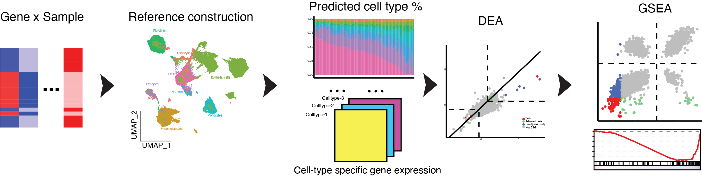

# SCdeconR



SCdeconR aims to provide a streamlined workflow from deconvolution of bulk RNA-seq data to downstream differential and gene-set enrichment analysis. SCdeconR provides a simulation framework to generate artificial bulk samples for benchmarking purposes. It also provides various visualization options to compare the influence of adjusting for cell-proportions differences on differential expression and pathway analyses. 

## Installation

``` r
# install devtools if it's not installed already
if (!require("devtools", quietly = TRUE)) install.packages("devtools")
devtools::install_github("liuy12/SCdeconR")
```

To use [scaden](https://github.com/KevinMenden/scaden) within SCdeconR, follow the below steps:

```r
# install reticulate package first
install.packages("reticulate")
```

Intall scaden python package:

Use pip: 

`pip install scaden`

Or use Conda:

`conda install scaden`

Then provide your desired python path (that have scaden installed) to option `pythonpath` for function `scdecon`. You should be good to go. 

The following packages are optional, and only needed for specific methods within SCdeconR. 

``` r
# install BiocManager if it's not installed already
if (!require("BiocManager", quietly = TRUE)) install.packages("BiocManager")

# data normalization
## scater
BiocManager::install("scater")

## scran
BiocManager::install("scran")

## Linnorm
BiocManager::install("Linnorm")

## SingleCellExperiment
BiocManager::install("SingleCellExperiment")

# deconvolution methods
## FARDEEP
install.packages("FARDEEP")

## nnls
install.packages("nnls")

## MuSiC
devtools::install_github('xuranw/MuSiC')

## SCDC
devtools::install_github("meichendong/SCDC")

# differential expression
## DESeq2
BiocManager::install("DESeq2")

# cell-type specific gene expression
## spacexr
devtools::install_github("dmcable/spacexr", build_vignettes = FALSE)

# interactive plot
install.packages("plotly")
```

## Usage

```r
library(SCdeconR)
```

See [here](https://liuy12.github.io/SCdeconR/) for detailed documentation and tutorials. 

See [here](https://htmlpreview.github.io/?https://github.com/Liuy12/SCdeconR/blob/master/inst/reprod_doc/Reproducible_document.html) for a document to reproduce the results from the study.
